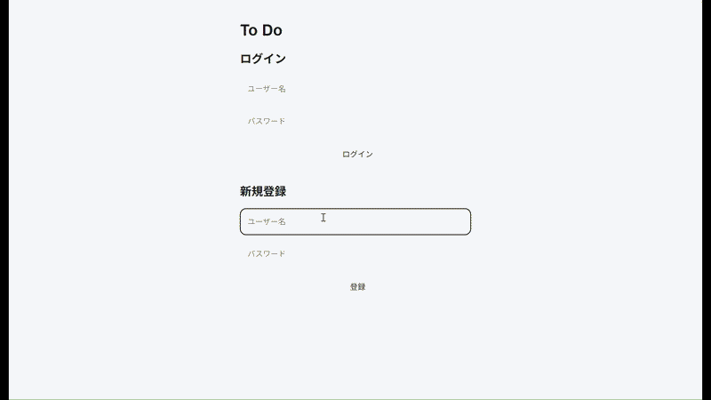
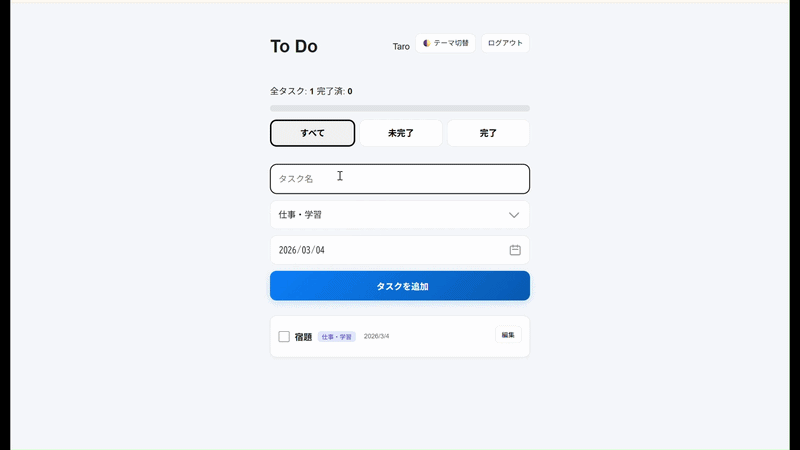

# タスク管理アプリケーション

## 🚀 公開URL
[https://todo-app-gjnm.onrender.com](https://todo-app-gjnm.onrender.com)

## 🎥 動作イメージ

### 🔐 ログイン・新規登録

### 📝 タスク操作（追加・並び替え・期限表示）

## 1. 開発の目的
日々状況が変わる中で、どのタスクが本当に急ぎなのかを直感的に判断し、期限の見落としを確実に防ぐことを目的に制作しました。単に予定を記録するだけでなく、その時々の判断で優先順位を自由に入れ替えられる操作性と、一目で危機感を持てる視覚的な工夫を重視しています。

## 2. 使用技術
* サーバーサイド: Node.js, Express（REST API設計）
* データベース: MySQL（Aiven MySQL・SSL接続）
* インフラ: Render（GitHub連携・自動デプロイ）
* 認証: bcrypt, express-session（セッション管理）
* フロントエンド: HTML5, CSS3, JavaScript（Drag & Drop API）

## 3. アプリの特徴
* 優先順位の直感的な操作: ドラッグ操作により、今最も取り組むべきタスクを物理的にリストの最上部へ移動させることができます。
* 期限切れの自動警告: 期限を過ぎた未完了のタスクは自動的に赤字で強調されるため、重要なタスクの放置を防ぎます。
* デバイスを選ばない使い心地: パソコンだけでなく、スマートフォンからもレイアウトが崩れずスムーズに操作できる設計を行っています。
* 進捗の可視化とテーマ切り替え: 全体の達成率をゲージで表示する機能や、利用環境に合わせたダークモードへの切り替え機能を搭載しています。

## 4. 開発におけるこだわりと学び
一番のこだわりは、画面上の直感的な操作とデータベース上の状態を常に一致させる設計を行ったことです。  
特にタスクの並び替え機能では、単純な更新処理では順序の不整合が発生する可能性があったため、トランザクション処理を導入し「全成功・全失敗」を保証する仕組みを実装しました。これにより、一部の更新失敗がデータ全体の整合性を崩さない設計としました。

また、レスポンシブデザインにも注力し、スマートフォン・PCいずれの環境でも操作性が損なわれないよう、余白やボタンサイズを細かく調整しました。UIの微調整を繰り返す中で、見た目の設計がユーザー体験に大きく影響することを実感しました。

本開発を通じて、フロントエンドの操作性だけでなく、その裏側で動くデータ処理や整合性設計の重要性を学びました。エラー発生時の原因特定や修正を積み重ねる中で、問題を分解して解決する力が身についたと感じています。